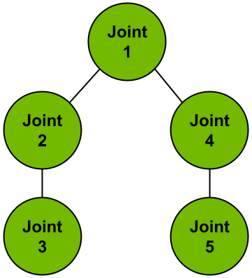
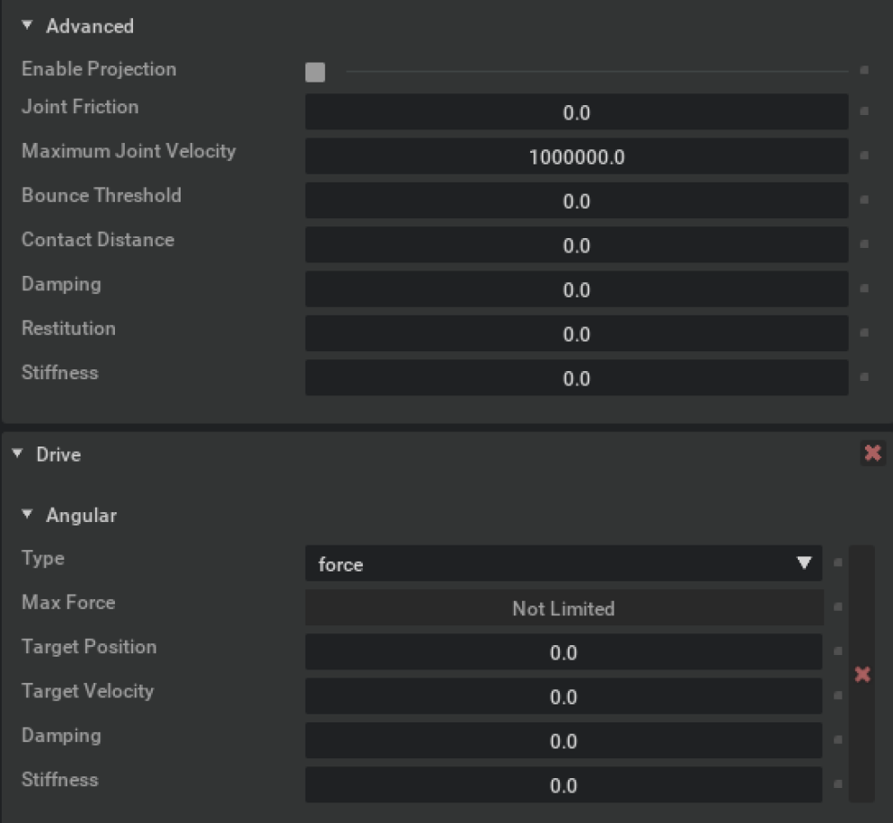

## Transfering Policies from Isaac Gym Preview Releases

This section delineates some of the differences between the standalone 
[Isaac Gym Preview Releases](https://developer.nvidia.com/isaac-gym) and 
Isaac Sim reinforcement learning extensions, in hopes of facilitating the 
process of transferring policies trained in the standalone preview releases 
to Isaac Sim.

### Isaac Sim RL Extensions

Unlike the monolithic standalone Isaac Gym Preview Releases, Omniverse is 
a highly modular system, with functionality split between various [Extensions](https://docs.omniverse.nvidia.com/extensions/latest/index.html).

The APIs used by typical robotics RL systems are split between a handful of 
extensions in Isaac Sim. These include `omni.isaac.core`, which provides 
tensorized access to physics simulation state as well as a task management 
framework, the `omni.isaac.cloner` extension for creating many copies of 
your environments, and the `omni.isaac.gym` extension for interfacing with
external RL training libraries.

For naming clarity, we'll refer collectively to the extensions used for RL 
within Isaac Sim as the **Isaac Sim RL extensions**, in contrast with the
older **Isaac Gym Preview Releases**.


### Quaternion Convention

The Isaac Sim RL extensions use various classes and methods in `omni.isaac.core`,
which adopts `wxyz` as the quaternion convention. However, the quaternion 
convention used in Isaac Gym Preview Releases is `xyzw`. Therefore, if a policy 
trained in one of the Isaac Gym Preview Releases takes in quaternions as part 
of its observations, remember to switch all quaternions to use the `xyzw` convention 
in the observation buffer `self.obs_buf`. Similarly, please ensure all quaternions 
are in `wxyz` before passing them in any of the utility functions in `omni.isaac.core`. 


### Assets

Isaac Sim provides [URDF](https://docs.omniverse.nvidia.com/isaacsim/latest/advanced_tutorials/tutorial_advanced_import_urdf.html) 
and [MJCF](https://docs.omniverse.nvidia.com/isaacsim/latest/advanced_tutorials/tutorial_advanced_import_mjcf.html) importers for translating URDF and MJCF assets into USD format.
Any robot or object assets must be in .usd, .usda, or .usdc format for Isaac Sim and Omniverse.
For more details on working with USD, please see https://docs.omniverse.nvidia.com/isaacsim/latest/reference_glossary.html#usd.
Importer tools are also available for other common geometry file formats, such as .obj, .fbx, and more.
Please see [Asset Importer](https://docs.omniverse.nvidia.com/extensions/latest/ext_asset-importer.html) for more details.


### Joint Order

Isaac Sim's `ArticulationView` in `omni.isaac.core` assumes a breadth-first 
ordering for the joints in a given kinematic tree. Specifically, for the following
kinematic tree, the method `ArticulationView.get_joint_positions` returns a 
tensor of shape `(number of articulations in the view, number of joints in the articulation)`.
Along the second dimension of this tensor, the values represent the articulation's joint positions 
in the following order: `[Joint 1, Joint 2, Joint 4, Joint 3, Joint 5]`. On the other hand, 
the Isaac Gym Preview Releases assume a depth-first ordering for the joints in the kinematic 
tree; In the example below, the joint orders would be the following: `[Joint 1, Joint 2, Joint 3, Joint 4, Joint 5]`.



With this in mind, it is important to change the joint order to depth-first in 
the observation buffer before feeding it into an existing policy trained in one of the 
Isaac Gym Preview Releases. Similarly, you would also need to change the joint order 
in the output (the action buffer) of the Isaac Gym Preview Release trained policy 
to breadth-first before applying joint actions to articulations via methods in `ArticulationView`.


### Physics Parameters

One factor that could dictate the success of policy transfer from Isaac Gym Preview 
Releases to Isaac Sim is to ensure the physics parameters used in both simulations are
identical or very similar. In general, the `sim` parameters specified in the 
task configuration `yaml` file overwrite the corresponding parameters in the USD asset.
However, there are additional parameters in the USD asset that are not included
in the task configuration `yaml` file. These additional parameters may sometimes
impact the performance of Isaac Gym Preview Release trained policies and hence need 
modifications in the USD asset itself to match the values set in Isaac Gym Preview Releases.

For instance, the following parameters in the `RigidBodyAPI` could be modified in the 
USD asset to yield better policy transfer performance: 

| RigidBodyAPI Parameter | Default Value in Isaac Sim | Default Value in Isaac Gym Preview Releases |
|:----------------------:|:--------------------------:|:--------------------------:|
|     Linear Damping     |            0.00            |            0.00            |
|     Angular Damping    |            0.05            |            0.00            |
|   Max Linear Velocity  |             inf            |            1000            |
|  Max Angular Velocity  |     5729.58008 (deg/s)     |         64 (rad/s)         |
|   Max Contact Impulse  |             inf            |            1e32            |


Parameters in the `JointAPI` as well as the `DriveAPI` could be altered as well. Note 
that the Isaac Sim UI assumes the unit of angle to be degrees. It is particularly
worth noting that the `Damping` and `Stiffness` paramters in the `DriveAPI` have the unit
of `1/deg` in the Isaac Sim UI but `1/rad` in Isaac Gym Preview Releases.

|     Joint Parameter    | Default Value in Isaac Sim | Default Value in Isaac Gym Preview Releases |
|:----------------------:|:--------------------------:|:--------------------------:|
| Maximum Joint Velocity |       1000000.0 (deg)      |         100.0 (rad)        |




### Differences in APIs

APIs for accessing physics states in Isaac Sim require the creation of an ArticulationView or RigidPrimView
object. Multiple view objects can be initialized for different articulations or bodies in the scene by defining
a regex expression that matches the paths of the desired objects. This approach eliminates the need of retrieving
body handles to slice states for specific bodies in the scene. 

We have also removed `acquire` and `refresh` APIs in Isaac Sim. Physics states can be directly applied or retrieved
by using `set`/`get` APIs defined for the views.
New APIs provided in Isaac Sim no longer require explicit wrapping and un-wrapping of underlying buffers. 
APIs can now work with tensors directly for reading and writing data. Most APIs in Isaac Sim also provide
the option to specify an `indices` parameter, which can be used when reading or writing data for a subset
of environments. Note that when setting states with the `indices` parameter, the shape of the states buffer
should match with the dimension of the `indices` list.

Note some naming differences between APIs in Isaac Gym Preview Release and Isaac Sim. Most `dof` related APIs have been
named to `joint` in Isaac Sim. `root_states` is now separated into different APIs for `world_poses` and `velocities`. 
Similary, `dof_states` are retrieved individually in Isaac Sim as `joint_positions` and `joint_velocities`. 
APIs in Isaac Sim also no longer follow the explicit `_tensors` or `_tensor_indexed` suffixes in naming.
Indexed versions of APIs now happen implicitly through the optional `indices` parameter.


### Task Configuration Files

There are a few modifications that need to be made to an existing Isaac Gym Preview Release 
task `yaml` file in order for it to be compatible with the Isaac Sim RL extensions. 

#### Frequencies of Physics Simulation and RL Policy

The way in which physics simulation frequency and RL policy frequency are specified is different
between Isaac Gym Preview Releases and Isaac Sim, dictated by the following three 
parameters: `dt`, `substeps`, and `controlFrequencyInv`. 

- `dt`: The simulation time difference between each simulation step.
- `substeps`: The number of physics steps within one simulation step. *i.e.* if `dt: 1/60`
and `substeps: 4`, physics is simulated at 240 hz. 
- `controlFrequencyInv`: The control decimation of the RL policy, which is the number of 
simulation steps between RL actions. *i.e.* if `dt: 1/60` and `controlFrequencyInv: 2`,
RL policy is running at 30 hz. 

In Isaac Gym Preview Releases, all three of the above parameters are used to specify 
the frequencies of physics simulation and RL policy. However, Isaac Sim only uses `controlFrequencyInv` and `dt` as `substeps` is always fixed at `1`. Note that despite 
only using two parameters, Isaac Sim can still achieve the same substeps definition 
as Isaac Gym. For example, if in an Isaac Gym Preview Release policy, we set `substeps: 2`, 
`dt: 1/60` and `controlFrequencyInv: 1`, we can achieve the equivalent in Isaac Sim 
by setting `controlFrequencyInv: 2` and `dt: 1/120`.

In the Isaac Sim RL extensions, `dt` is specified in the task configuration `yaml` file 
under `sim`, whereas `controlFrequencyInv` is a parameter under `env`.  

#### Physx Parameters

Parameters under `physx` in the task configuration `yaml` file remain mostly unchanged.

In Isaac Gym Preview Releases, `use_gpu` is frequently set to 
`${contains:"cuda",${....sim_device}}`. For Isaac Sim, please ensure this is changed 
to `${eq:${....sim_device},"gpu"}`. 

In Isaac Gym Preview Releases, GPU buffer sizes are specified using the following two parameters: 
`default_buffer_size_multiplier` and `max_gpu_contact_pairs`. With the Isaac Sim RL extensions,
these two parameters are no longer used; instead, the various GPU buffer sizes can be 
set explicitly. 
For instance, in the [Humanoid task configuration file](../omniisaacgymenvs/cfg/task/Humanoid.yaml),
GPU buffer sizes are specified as follows:

```yaml
    gpu_max_rigid_contact_count: 524288
    gpu_max_rigid_patch_count: 81920
    gpu_found_lost_pairs_capacity: 8192
    gpu_found_lost_aggregate_pairs_capacity: 262144
    gpu_total_aggregate_pairs_capacity: 8192
    gpu_max_soft_body_contacts: 1048576
    gpu_max_particle_contacts: 1048576
    gpu_heap_capacity: 67108864
    gpu_temp_buffer_capacity: 16777216
    gpu_max_num_partitions: 8
```

Please refer to the [Troubleshooting](./troubleshoot.md#simulation) documentation should 
you encounter errors related to GPU buffer sizes.

#### Articulation Parameters

The articulation parameters of each actor can now be individually specified tn the Isaac Sim 
task configuration `yaml` file. The following is an example template for setting these parameters:

```yaml
  ARTICULATION_NAME:
    # -1 to use default values
    override_usd_defaults: False
    fixed_base: False
    enable_self_collisions: True
    enable_gyroscopic_forces: True
    # per-actor
    solver_position_iteration_count: 4
    solver_velocity_iteration_count: 0
    sleep_threshold: 0.005
    stabilization_threshold: 0.001
    # per-body
    density: -1
    max_depenetration_velocity: 10.0
```

These articulation parameters can be parsed using the `parse_actor_config` method in the 
[SimConfig](../omniisaacgymenvs/utils/config_utils/sim_config.py) class, which can then be applied
to a prim in simulation via the `apply_articulation_settings` method. A concrete example of this
is the following code snippet from the [HumanoidTask](../omniisaacgymenvs/tasks/humanoid.py#L75):

```python
self._sim_config.apply_articulation_settings("Humanoid", get_prim_at_path(humanoid.prim_path), self._sim_config.parse_actor_config("Humanoid"))
```
#### Additional Simulation Parameters

- `use_fabric`: Setting this paramter to `True` enables [PhysX Fabric](https://docs.omniverse.nvidia.com/prod_extensions/prod_extensions/ext_physics.html#flatcache), which offers a significant increase in simulation speed. However, this parameter must 
be set to `False` if soft-body simulation is required because `PhysX Fabric` curently only supports rigid-body simulation.
- `enable_scene_query_support`: Setting this paramter to `True` allows the user to interact with prims in the scene. Keeping this setting to `False` during
training improves simulation speed. Note that this parameter is always set to `True` if in test/inference mode to enable user interaction with trained models.


### Training Configuration Files

The Omniverse Isaac Gym RL Environments are trained using a third-party highly-optimized RL library, 
[rl_games](https://github.com/Denys88/rl_games), which is also used to train the Isaac Gym Preview Release examples 
in [IsaacGymEnvs](https://github.com/NVIDIA-Omniverse/IsaacGymEnvs). Therefore, the rl_games training 
configuration `yaml` files in Isaac Sim are compatible with those from IsaacGymEnvs. However, please
add the following lines under `config` in the training configuration `yaml` files (*i.e.* 
line 41-42 in [HumanoidPPO.yaml](../omniisaacgymenvs/cfg/train/HumanoidPPO.yaml#L41)) to ensure
RL training runs on the intended device.

```yaml
    device: ${....rl_device}
    device_name: ${....rl_device}
```